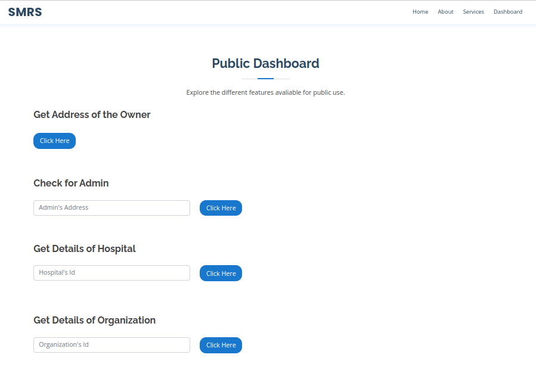

<!-- PROJECT NAME -->
<div align="center">
  <h1 align="center">SMRS</h1>
  <p align="center">
    <a href="">View Demo</a>
  </p>
</div>

<!-- TABLE OF CONTENTS -->

## Table of Contents

- [Group Members](#group-members)
- [Overview](#overview)
  - [The Problem](#the-problem)
  - [Screenshot](#screenshot)
- [](#the-solution)
  - [Built with](#built-with)
  - [how it works](#how-it-works)
  - [how to use it](#how-to-use)
- [Getting Started](#getting-started)
- [Made by](#made-by)

## group-members

- **ASIIMWE FRED**
- **Baluku Wilton**
- **Mutebi Paul**
- **Ouma Benerd Ochienge**

## Overview

SMRS is a decentralized solution for Electronic Medical Records sharing systems (EMR). It uses Ethereum network and IPFS technology at its core, giving you complete control of your data. Only authorized people and registered Medical Institutes can access your records.

Why Choose SMRS:

- The entire system of SMRS is based on blockchain technology. Hence it is practically un hackable
- There is no actual person behind the organization. It is a smart contract, making it transparent to the public
- All the media is stored on InterPlanetary File System (IPFS) network. Making it completely safe and private.

<!-- THE PROBLEM -->

<a id="the-problem"></a>

## The Problem

An electronic health record is defined as an electronic version of a medical history of the patient as kept by the health care provider. But it consists of some major security and privacy flaws.

- **Potential Cybersecurity Issues** :
  The data of the patients lies on a centralized database, which are prone to Denial of Service (DoS) attacks and single point of failure
- **Privacy of Patients** :
  If the database ever gets hacked. The data of the Patients can get leaked into the world which is unethical. Centralized systems are vulnerable to privacy attacks as well.
- **Inaccurate Data**
  If an EMR is not updated immediately, as soon as new information is known, such as after test results come in, anyone viewing that EMR could receive incorrect. This could lead to errors in diagnosis and treatment.
- **Time and Money**
  It also takes time to demo EHR products and negotiate with EHR system vendors to choose and implement the right system for your practice.

### Screenshot




## The Solution

SMRS provides a decentralized easy to use Electronic Medical Record system(EMR). It is a free to use web application providing a feature rich as well as interactive UI making it easy to use.

- **Minimal Security Risks**
  As previously mentioned. We use Ethereum Network for our computation making it very safe and secure. There cannot be a single point of failure.
- **Complete Privacy**
  The application used IPFS technology for storage of patient's data. Every patient can control who can access their data. Only registered Organizations and verified Medical Institute can access your data.
- **Verifies Admins**
  For a Medical Institute to participate in this shared system, it need to be verified by one of the admins. Same goes for the Organizations. They require proper medical and identity license to be successfully registered.
- **Non Profit**
  SMRS is a free to use, non profit system. One does not need to buy this software. It is available for everyone. There are some public open features which can be accessed by anyone, be it admin, owner or someone visiting the website for he first time. All that is required is a crypto wallet.

### Built With

- [Ethereum](https://ethereum.org/en/)
- [Solidity](https://soliditylang.org/)
- [Truffle](https://trufflesuite.com/)
- [React.js](https://reactjs.org/)
- [Bootstrap](https://getbootstrap.com)
- [IPFS](https://ipfs.tech/)

## How Does It Work

The application offers a variety of services. Some of them open for the public to see and test out themselves. The main flow of the application goes as follows.

- There is one owner of the smart contract of the application who's ownership is transferable.
- The owner can add or remove new Admins. The owner itself is an admin.
- Only an admin can register new Hospitals in the network, as well as other Organization that want to view the user data
- For registration in the network the hospital as well as organization must have a license.
- The license will be uploaded to IPFS as a proof.
- Every time a new medical record needs to be added, the hospital fills in all the details for the record and adds it under the id of the patient. If the patient does not exit, the hospital also adds new Patient to the network.
- Each patient must have a unique ID number so we decided to use NIN Number of the person as ID.
- Only registered Hospital, Organizations and the patient himself is able to see it's records.
- If any registered hospital wants to fetch the details of a patient or his medical record, it can do so. But if any organization wants to do the same, it must take an authority by the patient.
- Each patient can grant as well as revoke authorization to some address or Organization address.

<!-- HOW TO USE -->

## How To Use

1. Make sure you have your Meta Mask crypto wallet installed
2. If you do not have Meta Mask head over to [Meta Mask](https://metamask.io/) and follow the instruction.
3. After you have setup your crypto wallet, now you need to have some test Ether. visit [Ether Faucet](https://sepoliafaucet.com/) and enter your account address to receive test ether.
4. After you have received Test Ether in your account, you are all setup to use SMRS.
5. On your network tab on the top right corner of meta mask, select Sepolia Test Net.
6. You are all setup to use SMRS. Head over to the public dashboard in the application to connect to the blockchain using your Meta Mask wallet and try out the various features.
   (HINT : Try Hospital ID 1 to 4 to get their details)
7. For the developers you can test it out on a local blockchain using Ganache.

<!-- GETTING STARTED -->

## Getting Started

_To download the source code and on your machine and get it up and running, follow the given steps_

1. Clone the repo
   ```sh
   git clone https://github.com/FredZabu/csc-final-year-project-2023.git
   ```
2. Install NPM packages
   ```sh
   npm install
   ```
3. Run the Application
   ```sh
    npm start
   ```
4. Build for production
   ```sh
    npm run build
   ```

<!-- MADE BY -->

## Made By

<table>
  <tbody><tr>
    <td align="center"><a href="https://github.com/FredZabu"><br><sub><b>Fred Zabulon </b></sub></a><br/></a></td>
    </td>
  </tbody></tr>
</table>
